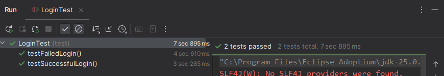
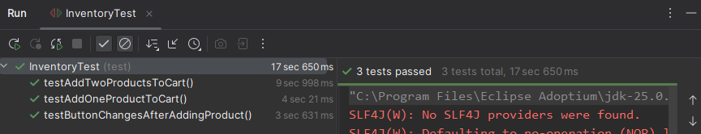

# SauceDemo Automation Project - Selenium & POM

This project is a comprehensive test automation suite for the [SauceDemo](https://www.saucedemo.com/) website. Built
using **Java**, **Selenium WebDriver**, and **JUnit 5**, it implements the **Page Object Model (POM)** design pattern to
ensure the code is modular, readable, and easy to maintain.

## Tech Stack

* **Java**: Core programming language.
* **Selenium WebDriver**: Browser automation library.
* **JUnit 5**: Testing framework for execution and assertions.
* **WebDriverManager**: Automatic management of browser drivers.
* **Maven**: Project and dependency management.

## Project Structure

```text
PruebasSelenium16.2/
├── src/
│   └── test/
│       └── java/
│           ├── pages/
│           │   ├── InventoryPage.java  (Inventory elements definition)
│           │   └── LoginPage.java      (Login elements definition)
│           └── test/
│               ├── InventoryTest.java  (Inventory logic validation)
│               └── LoginTest.java      (Login logic validation)
├── inventoryTest.png                   (Inventory test evidence)
├── loginTest.png                       (Login test inventory)
├── pom.xml                             (Maven dependency configuration)
└── README.md                           (Project documentation)
```

### Pages (Page Object Model)

* **`LoginPage.java`**: Encapsulates the login form elements (username, password, login button) and provides methods for
  user authentication and error message capture.
* **`InventoryPage.java`**: Manages the product catalog interface, including adding items to the cart, retrieving the
  cart badge count, and verifying the visibility of state-specific buttons like "Remove".

### Tests

* **`LoginTest.java`**: Contains test cases for both successful authentication and failure scenarios with incorrect
  credentials.
* **`InventoryTest.java`**: Focuses on the shopping cart logic, ensuring items are correctly added and the UI updates
  dynamically according to user actions.

## Test Execution

The test suite is designed for independent execution. For the inventory tests, a pre-condition is established in the
`@BeforeEach` method to perform an automated login, ensuring every test starts directly from the products page.

### Automated Test Cases:

1. **`testSuccessfulLogin`**: Verifies that a user is correctly redirected to the inventory page after providing valid
   credentials.
2. **`testFailedLogin`**: Confirms that the system displays the appropriate error message when login fails.
3. **`testAddOneProductToCart`**: Ensures the cart badge updates to "1" immediately after adding a single product.
4. **`testAddTwoProductsToCart`**: Validates that the cart badge correctly increments (for example, to "2") when
   multiple items
   are added.
5. **`testButtonChangesAfterAddingProduct`**: Confirms that the "Add to cart" button successfully toggles to "Remove,"
   verifying a correct UI state change.

## Execution Evidence

### Login Suite Results



### Inventory & Cart Suite Results



---

## Personal Appreciation and Reflection

In this project, I learned how to use the Page Object Model (POM) to keep my automation code organized and clean. It was
cool to see how separating the page elements from the test steps makes everything easier to manage. I had a little
trouble with the cart badge and the "Remove" button visibility at first, but using .isDisplayed() solved it. Doing the
project in English was a challenge but very helpful for learning technical terms.